# Marvin — a personal assistant that lives on my computer

🇷🇺 Русская версия → [README.md](README.md)

## What this even is

Marvin is my personal assistant. It lives on my PC, knows my money, tasks, calendar, orders and notes, and answers wherever I am: in Telegram, in the browser, or by voice into a mic. I just talk to it like a person — "spent 700 on a taxi", "meeting with Dima on Wednesday at 15:00", "order: a video for 25k, due Friday" — and everything lands in one database on my own disk.

No accounts, no subscriptions, no one else's profile: you can keep the data from ever leaving the machine. I built it because I wanted a tracker I don't have to maintain by hand, and an assistant that sees the whole picture instead of a pile of separate apps.

## What it can do

### money
Accounts, spending and income, recurring payments, debts with a "paid off in N months" forecast, envelope-style goals ("saving up for a camera"). Marvin sorts spending into categories by itself, and you can add your own categories and monthly limits. There's also "how much can I spend today" and a 30-day cash forecast. Send it a bank statement as a file (CSV/PDF/Excel) and it won't double-count anything; transfers between your own accounts get skipped.

### tasks and goals
Tasks with priorities and projects, deadlines that are "for the day" or "at a time". Goals → milestones → tasks: not a to-do list, but the thing the list is for. Habits and smart postponing: if my own records show I usually reply around 8pm, Marvin offers a "⏰ by habit" button. "What should I do today?" builds a focus for the day out of the steps that actually move my goals.

### calendar
Events and repeats (daily / weekly / monthly / yearly), reminders in Telegram and in the browser. A task with a time shows up in the calendar, and a meeting and a task are linked: move one and the other moves, close one and the other closes. If you want, the calendar syncs to Google Calendar (one way: assistant → Google).

### orders (freelance)
An order is a deadline in the calendar, expected income in the cash forecast, and a work timer, all in one place. Stages (discussion → in progress → revisions → delivered → paid), payments and advances, client debts. If there's history on similar past orders, Marvin suggests a price and hours. There's "who's late paying", monthly tax, and your actual hourly rate.

### second brain
Notes and links with previews, auto-tags, semantic search (it searches by meaning, not by letters), and a graph of connections between people, orders, thoughts and tags. A day feed: what I did, what I closed, when I stepped away. People get their own cards with relationships, orders, debts and birthdays; Marvin quietly reminds me who's who.

### reports and initiative
A morning digest, an evening question about unfinished stuff, weekly and monthly recaps, and a separate "what am I missing" block (overdue payments, tasks with no deadline, goals that stopped moving). Marvin can write first when it notices something important — but it has a daily cap, quiet hours, and one honest "now / later / stay silent" decision.

### voice and the computer
Offline wake word, local speech recognition (Whisper), and speech (edge or offline Silero). By voice you can control the PC: open a site or an app, find a file, tidy up Downloads and the Desktop (with a plan and an undo — files are never deleted), or ask what's on screen. Screen time, an organizer for editing folders, and Downloads cleanup live here too.

### telegram
About 40 everyday commands work offline and without any neural network — instantly. Replies can come as image cards, and the site opens right inside Telegram as a mini app (Telegram confirms the login itself). Phone access without fiddling with QR codes or VPN.

### website
The same assistant in the browser: Today, Tasks, Calendar, Finance, Orders, Board, Mind, People, Memory, Settings. Dark and light theme, a custom accent per tab, a chat that shares one history with Telegram, and it works as an app (PWA).

### reliability
The whole database is a single file. It's backed up every night, and you can restore from any snapshot right in Settings — with a safety copy of the current state saved before the restore. Secrets (bot token, cloud keys) live in `config.yaml`, which is in `.gitignore`. Marvin never deletes your files.

### coming soon
The moodboard and storyboard/reference board for editing is still being worked on. The idea is simple: gather references, storyboards and scenes on a single sheet that the assistant can also see. It's not done yet, so I'm not calling it ready. I'll write about it here once it is.

## A few words from me

- I mostly build this bot for myself, I test everything myself and fold it into my own life
- Yeah, there are billions of JARVIS-style assistants out there that'll wash your floors for you — I'm not pretending to be the next openclaw or to turn into some b2b saas p2p 2b2t txt startup, it's just a homegrown little assistant build
- Security matters a lot to me in this bot — sure, who cares that I eat sausage in the morning, but I still don't want to put my whole life on public display, so it's already covered here, I run audits and try to close holes when they show up...
- From experience it's a fun thing: it really helps with order tracking and just seeing the overall picture of my finances and life, and it takes some load off my head in a huge stream of information
- I welcome any additions and features someone might come up with, and I'll be glad for any feedback
- You could call it a niche hobby — building something like this, so yeah....

## Quick start

Windows:

1. Install [Python 3.12](https://www.python.org/downloads/release/python-3120/) and tick **"Add python.exe to PATH"** during setup.
2. `install.bat` — double-click (2–5 minutes).
3. `start.bat` — a browser opens with the wizard: name → the brain for your hardware → cloud key (optional) → Telegram bot.
4. Optional: `install_voice.bat`, then `voice.bat` — for voice from your PC mic.

Linux / macOS: `./install.sh`, then `./start.sh` (on macOS there are `.command` files: `Install-Mac.command`, `install.command`, `start.command`, `voice.command`).

If something didn't install — `doctor.bat` (or `./doctor.sh`) shows what's in place and what needs fixing. Settings priority: environment variable → `.env` → `config.yaml` (the first one set wins).

## Privacy: local / hybrid / cloud

Three modes — you pick one in the wizard or later in Settings. The point is where the "brain" goes to answer.

| Mode | Where it thinks | What leaves the machine |
|---|---|---|
| 🔒 `local` | only Ollama on my PC | nothing, works with no internet |
| ⚖️ `hybrid` — default | personal stuff (money, calendar, notes, files) locally, general questions in the cloud | only general questions and small talk, anonymized (names, amounts, phone numbers stripped) |
| ☁️ `cloud` | everything at the API provider | basically everything: notes and spending included |

Every reply is tagged with its source: ⚡ rule (no neural network) · 🧠 local · ☁️ cloud. If there's no cloud at all, the local model handles everything.

## From your phone

- **Tailscale.** `phone.bat` opens the port in the firewall, and Settings shows a QR code with the link. Your phone remembers the access key for a year — the site is reachable from anywhere, no static IP needed. Home Wi-Fi works as a fallback.
- **Telegram mini app.** `funnel.bat` sets up a public HTTPS address via Tailscale Funnel once; after you restart `start.bat`, an "Open" button appears in the bot chat. The site opens right inside Telegram, Telegram confirms the login — no QR, no VPN on the phone. Your data still stays on the PC.

Details and the security breakdown — [docs/telegram-miniapp.md](docs/telegram-miniapp.md) (in Russian).

## Security: what lives where

- The whole database — `data/assistant.db` (SQLite). Note and receipt images — `data/media/`. The access key for other devices — `data/api_token`.
- Secrets (bot token, cloud keys, Google) — in `config.yaml`, which is in `.gitignore`. The API only ever returns them masked.
- Backups run every night into `data/backups/` (kept for 30 days). You can restore right from Settings — and a snapshot of the current database is saved first, just in case.
- In `hybrid` mode only general questions and small talk reach the cloud, already anonymized. Personal stuff — money, calendar, notes, files — is handled locally. In `cloud` mode everything honestly goes out.
- The assistant **never deletes** files on your PC: it only moves them. Large sums and shutting the computer down happen only after I say "yes".
- From another device the API is locked behind the access key; the bot only answers my Telegram ID; mini-app logins are verified with Telegram's signature.

## Screenshots

  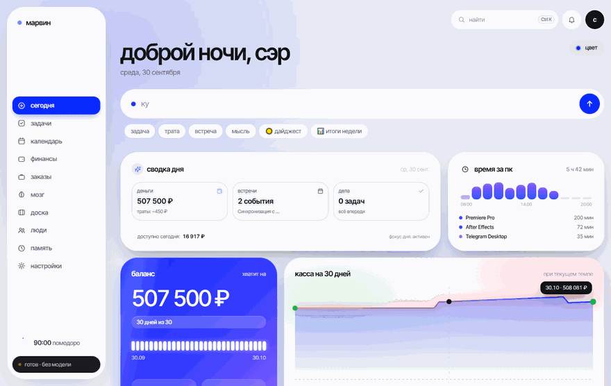

  
  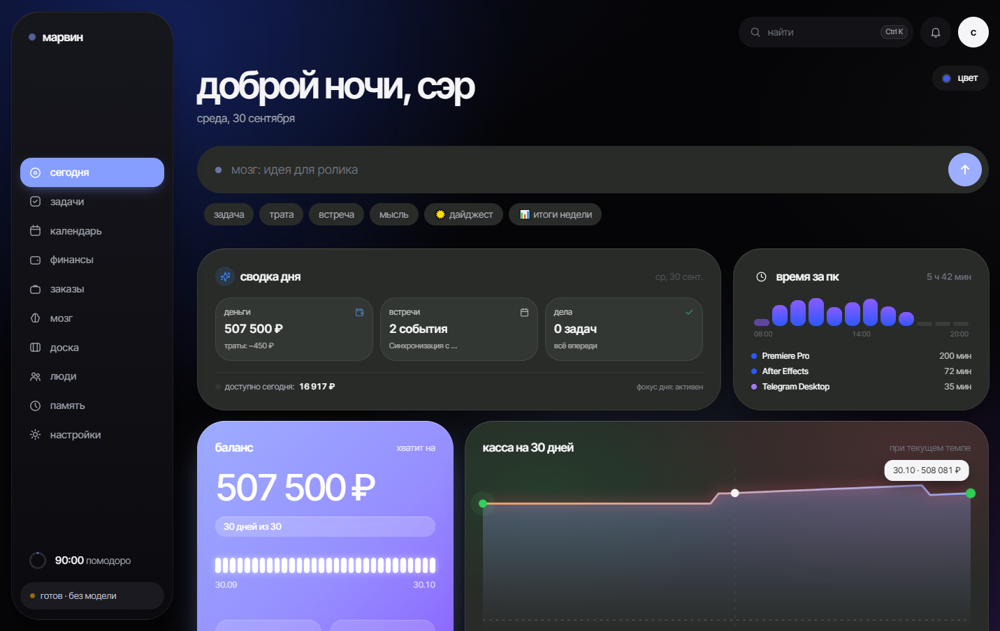

  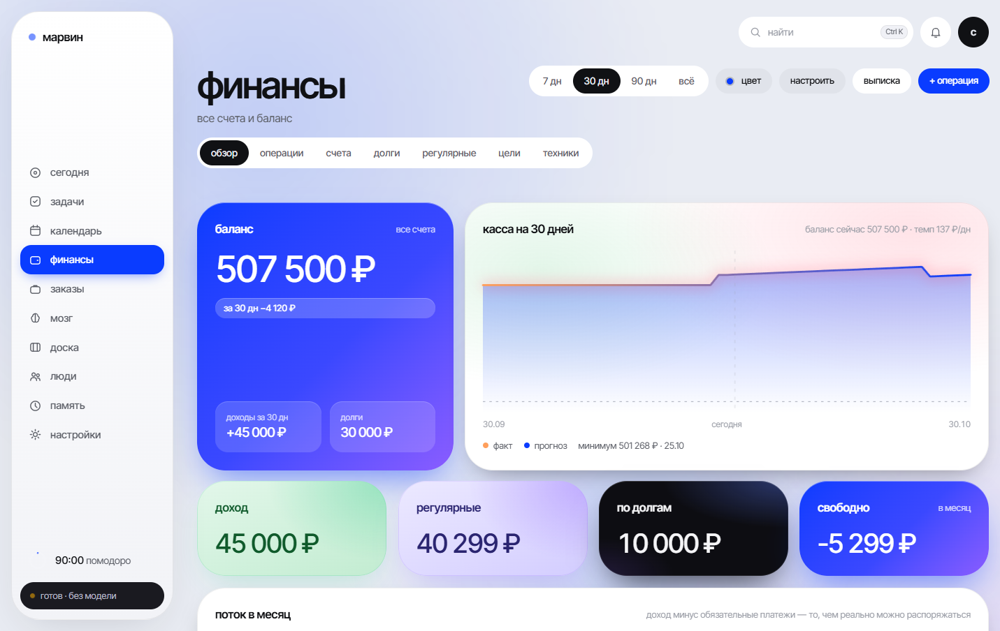

  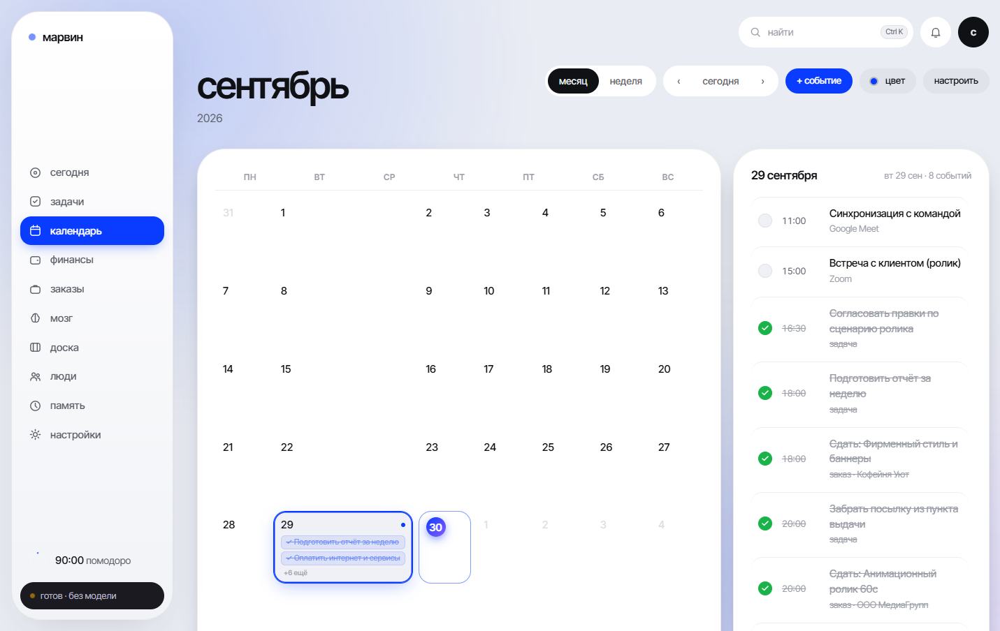

  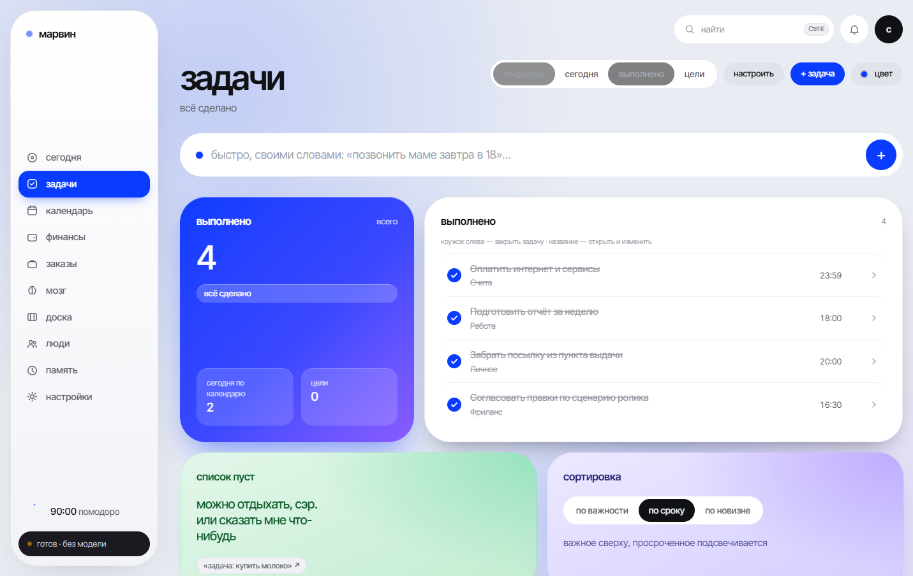
  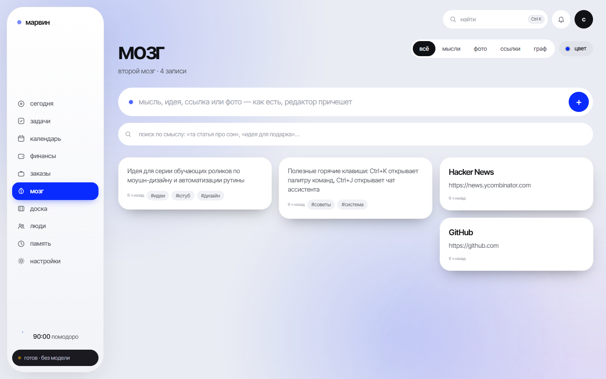

  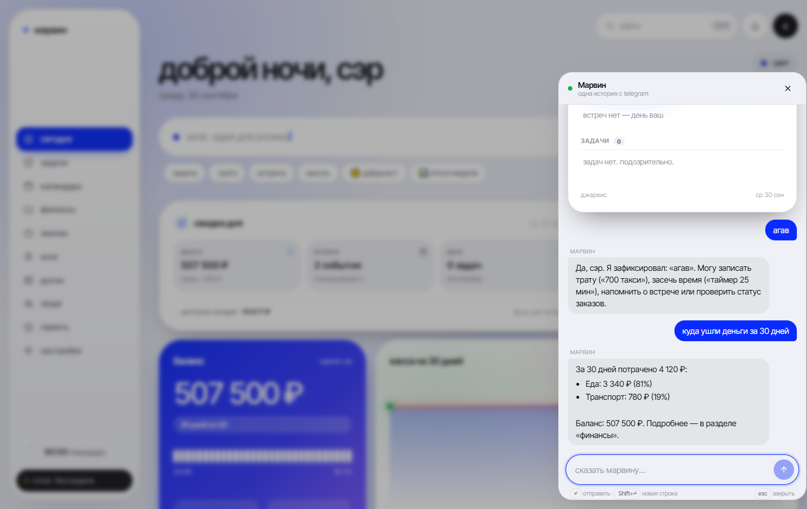

  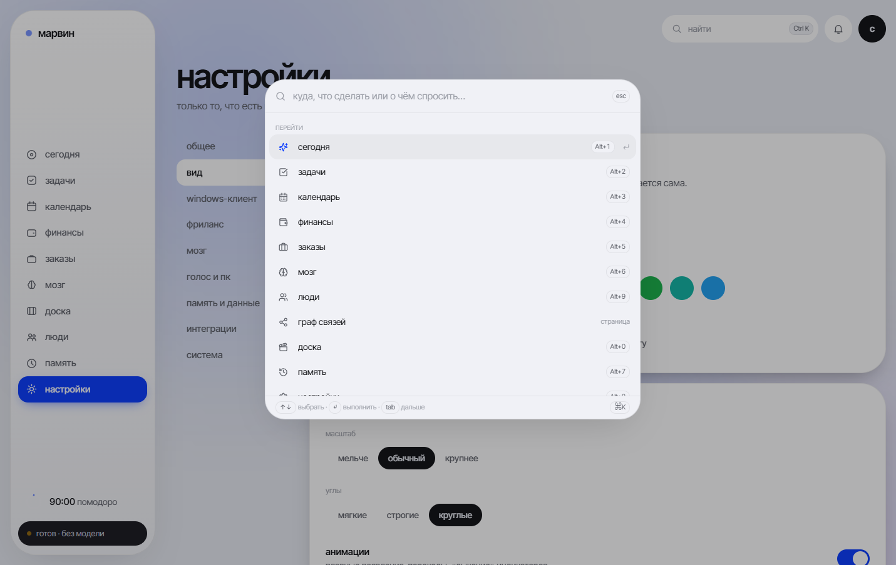
  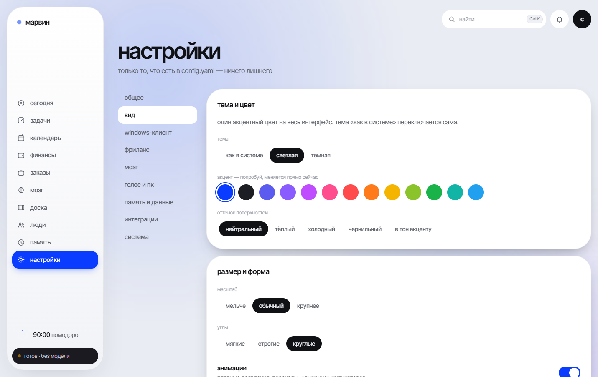

  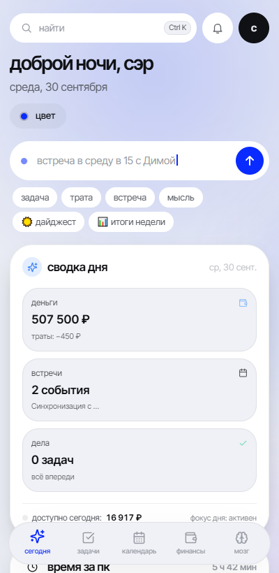
  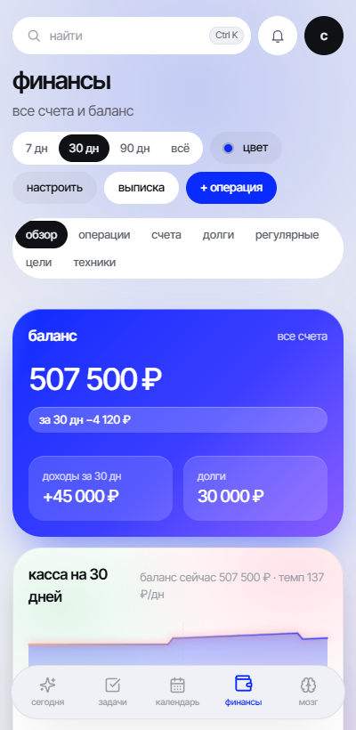

## Docs and the rest

- Install: Windows, Linux/macOS, Docker, voice, phone — [docs/INSTALL.md](docs/INSTALL.md) (Russian)
- What it can do in detail — [docs/features.md](docs/features.md); all commands by area — [docs/COMMANDS.md](docs/COMMANDS.md) (Russian)
- Settings and the example config — [docs/CONFIGURATION.md](docs/CONFIGURATION.md) · [config.example.yaml](config.example.yaml)
- Privacy: what leaves your machine and what never does — [docs/PRIVACY.md](docs/PRIVACY.md) (Russian)
- Voice on the PC — [docs/VOICE.md](docs/VOICE.md) (Russian)
- The UI: sections, gestures, hotkeys — [docs/UI.md](docs/UI.md) (Russian)
- The brain: modes, models for your GPU, cloud providers — [docs/brain.md](docs/brain.md) · [docs/small-model.md](docs/small-model.md) (Russian)
- How it works inside (with a diagram) — [docs/ARCHITECTURE.md](docs/ARCHITECTURE.md) (Russian)
- Public access: mini app, Tailscale Funnel — [docs/telegram-miniapp.md](docs/telegram-miniapp.md) (Russian)
- A second assistant for someone close — [docs/second-copy.md](docs/second-copy.md) (Russian)
- If something breaks — [docs/troubleshooting.md](docs/troubleshooting.md) (Russian)
- Development and structure — [docs/development.md](docs/development.md) (Russian)
- What's next — [docs/ROADMAP.md](docs/ROADMAP.md) · change history — [CHANGELOG.md](CHANGELOG.md)

Want to fix or add something? Send a pull request — new phrase templates (the offline, no-neural-network commands) with tests are especially welcome. How everything fits together and how to contribute — [CONTRIBUTING.md](CONTRIBUTING.md); security — [SECURITY.md](SECURITY.md).

License — [Apache 2.0](LICENSE): take it, change it, use it anywhere, but keep the attribution (the [NOTICE](NOTICE) file) and mark what exactly you changed.

Telegram channel — "soone | монтаж". Website — [https://imsoone.ru](https://imsoone.ru).
