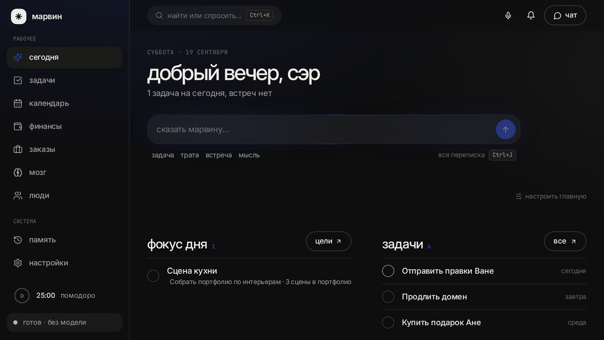
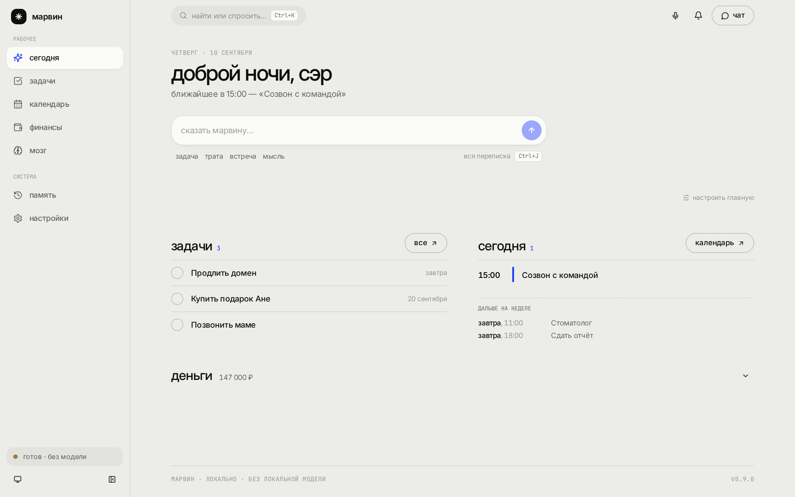
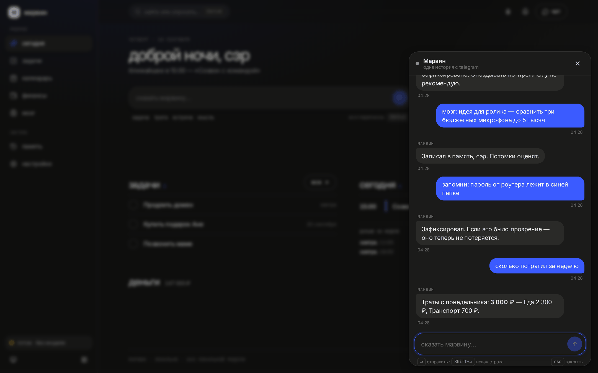
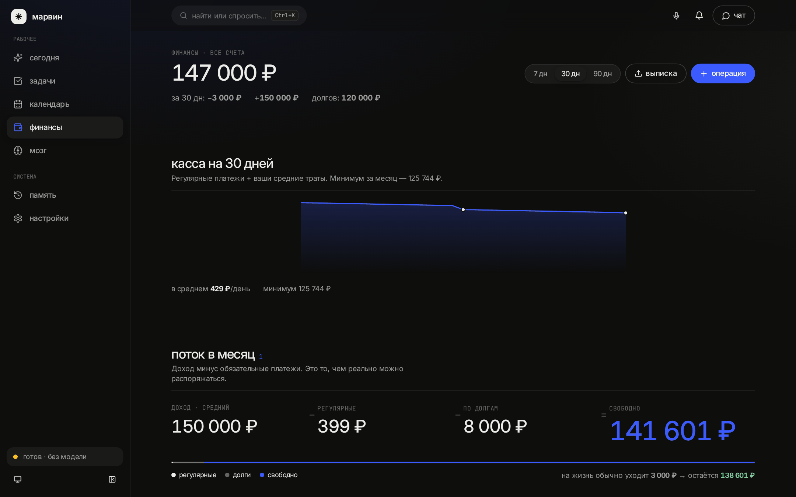
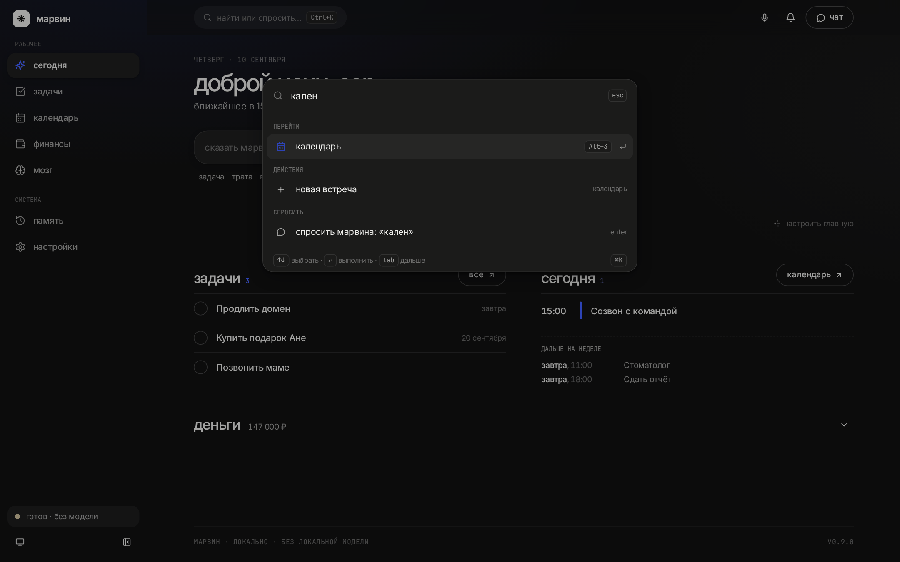
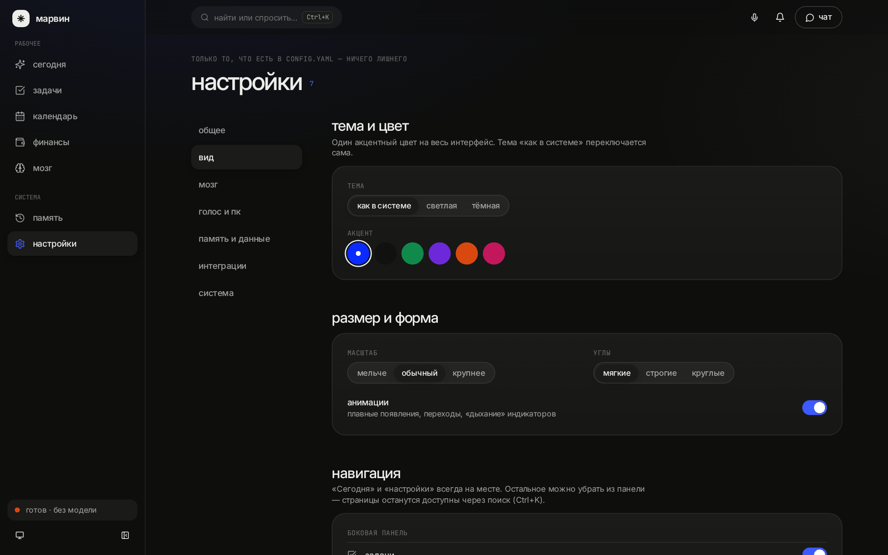
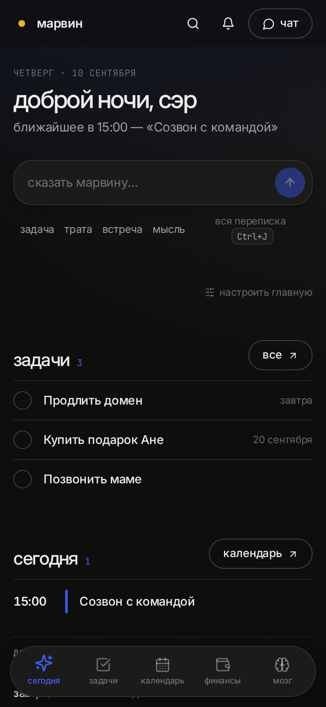
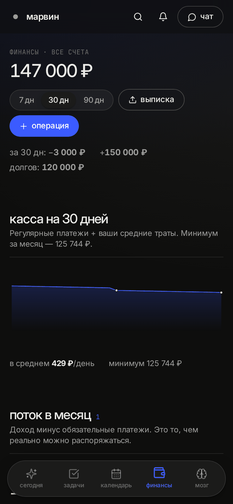

# Личный ассистент на вашем компьютере

**Деньги, календарь, задачи и «второй мозг» — обычной речью.** Пишете в Telegram, на сайте или говорите в микрофон ПК; всё ложится в одну базу на вашем диске, ассистент напоминает, считает и отвечает. Имя ему даёте сами.

Для тех, кто хочет **своего** ассистента, а не подписку: один процесс на Windows (или Docker), никаких аккаунтов, база — обычный файл, личные данные можно вообще не выпускать с компьютера.

**Программировать не нужно:** два .bat-файла и мастер в браузере.

  

  

---

## Пять вещей, ради которых это стоит поставить

| | Пример | Что происходит |
|---|---|---|
| 💸 **Деньги без приложения банка** | `700 такси` · `зп 150 тыс` · `долг банку 120к плачу 8к 25-го` · `куда ушли деньги` | категории сами, баланс, касса на 30 дней, долги с прогнозом «закроется через N мес.», фото чека → трата |
| 📅 **Календарь и задачи словами** | `встреча в среду в 15 с Димой` · `напомни через 20 минут достать стирку` · `надо сдать отчёт в пятницу` | напоминания в Telegram и голосом, повторы, push в Google Календарь; свайпы на телефоне |
| 🧠 **Второй мозг** | `мозг: идея для ролика…` · `запомни …` · любая ссылка · фото с подписью | заголовок, обложка, авто-теги, смысловой поиск по всему, что вы когда-либо скинули |
| 🎙 **Голос и компьютер** | «Марвин, открой браузер» · «найди файл договор» · «что на экране» | слово-активация офлайн, распознавание Whisper, озвучка; файлы **никогда не удаляются** |
| 🔒 **Приватность по умолчанию** | режим `local` / `hybrid` / `cloud` | личное считается на вашей видеокарте; в облако — только общие вопросы, обезличенно; каждый ответ помечен ⚡ правило · 🧠 локально · ☁️ облако |

Около 40 бытовых команд работают **вообще без нейросети** — мгновенно и офлайн. Плюс утренний дайджест, вечерний «что с задачами?», недельный отчёт, откат любого действия («отмени последнюю»), ночные бэкапы. [Полный список →](docs/features.md)

  
  

  
  

  
  

---

## Быстрый старт (Windows, ~10 минут)

1. Поставьте [Python 3.12](https://www.python.org/downloads/release/python-3120/) — при установке отметьте **«Add python.exe to PATH»**.
2. Скачайте архив (**Code → Download ZIP** или [Releases](../../releases)), распакуйте, например, в `C:\Assistant`.
3. **`install.bat`** — двойной клик, 2–5 минут.
4. **`start.bat`** — откроется браузер с мастером: имя → мозг под вашу видеокарту (модель скачается кнопкой) → ключ облака (по желанию) → Telegram-бот от [@BotFather](https://t.me/BotFather).

После «готово» ассистент напишет вам в Telegram. Окно `start.bat` держите открытым или добавьте в автозагрузку (`autostart.bat`).

- **С телефона:** `phone.bat` + QR-код в ⚙ Настройки → «с телефона». Откуда угодно — через [Tailscale](https://tailscale.com).
- **Голос на ПК:** `install_voice.bat`, затем `voice.bat`.
- **Docker / Linux / Mac:** `cp config.example.yaml config.yaml && docker compose up -d`.

Подробно, с картинками и типичными ошибками — [docs/install.md](docs/install.md).

---

## Железо и границы приватности

| Режим | Что нужно | Куда уходят данные |
|---|---|---|
| 🔒 **local** | видеокарта от 4–6 ГБ (или 16 ГБ ОЗУ — медленно) + [Ollama](https://ollama.com) | никуда. Работает без интернета |
| ⚖️ **hybrid** *(рекомендуем)* | то же + бесплатный ключ облачного API | деньги, календарь, заметки, файлы — **локально**; общие вопросы и разговор — в облако, с вырезанными именами/суммами/телефонами |
| ☁️ **cloud** | любой ноутбук | всё у провайдера API — включая ваши заметки и траты |

Мастер сам определит видеокарту и предложит модель (от `qwen3.5:0.8b` для 1 ГБ до `qwen3.5:27b` для 18+ ГБ). Облачные провайдеры: Groq, OpenRouter, NVIDIA NIM, DeepSeek, свой OpenAI-совместимый сервер. Таблица моделей и провайдеров — [docs/brain.md](docs/brain.md).

Что гарантируется в любом режиме:

- бот отвечает **только** вашему Telegram ID;
- вся база — файл `data/assistant.db`; бэкап = копия файла (ночью делается сама);
- с других устройств API открыт только по ключу доступа (зашит в QR из настроек);
- ассистент **никогда не удаляет** файлы на ПК; крупные суммы и выключение компьютера — только после вашего «да»;
- токены и ключи — в `config.yaml`, он в `.gitignore`.

> Про бесплатные лимиты и доступность облачных провайдеров: проверено 10.09.2026, у провайдеров это меняется без предупреждения. Если модель пропала — ⚙ Настройки → облако → «проверить» покажет причину, поле модели можно оставить пустым.

---

## Документация

- [Установка: Windows, Docker, голос, телефон, Google Календарь](docs/install.md)
- [Что умеет — все команды по областям](docs/features.md)
- [Мозг: режимы, модели под видеокарту, облачные провайдеры](docs/brain.md)
- [Если что-то не так + горячие клавиши](docs/troubleshooting.md)
- [Разработка и структура проекта](docs/development.md) · [Архитектура](ARCHITECTURE.md) · [Дизайн-система сайта](web/DESIGN.md)
- [История изменений](CHANGELOG.md) · [Планы](ROADMAP.md)

Стек: Python 3.11+ · FastAPI · SQLite · aiogram 3 · Ollama · faster-whisper · Vosk · Silero / edge-tts · React + Vite + Tailwind. Лицензия — [MIT](LICENSE). Нашли ошибку — [issue](../../issues/new/choose); pull request'ы приветствуются, особенно новые фразы-шаблоны в `core/brain/quick.py` с тестами.
