# Marvin

Личный ассистент, который живёт на моём компьютере. Деньги, календарь, задачи, заказы, заметки, «второй мозг» и голос — всё в одной базе на одном диске.

Пишу ему обычной речью: в Telegram, на сайте или в микрофон («Марвин, …»). Он разбирает фразу сам, записывает, считает, напоминает и отвечает с характером. Без аккаунтов, подписок и облака: локально работает всё, в облако уходит только то, что я разрешил.

<p align="center">
  
</p>

<p align="center">
  
</p>

<p align="center">
  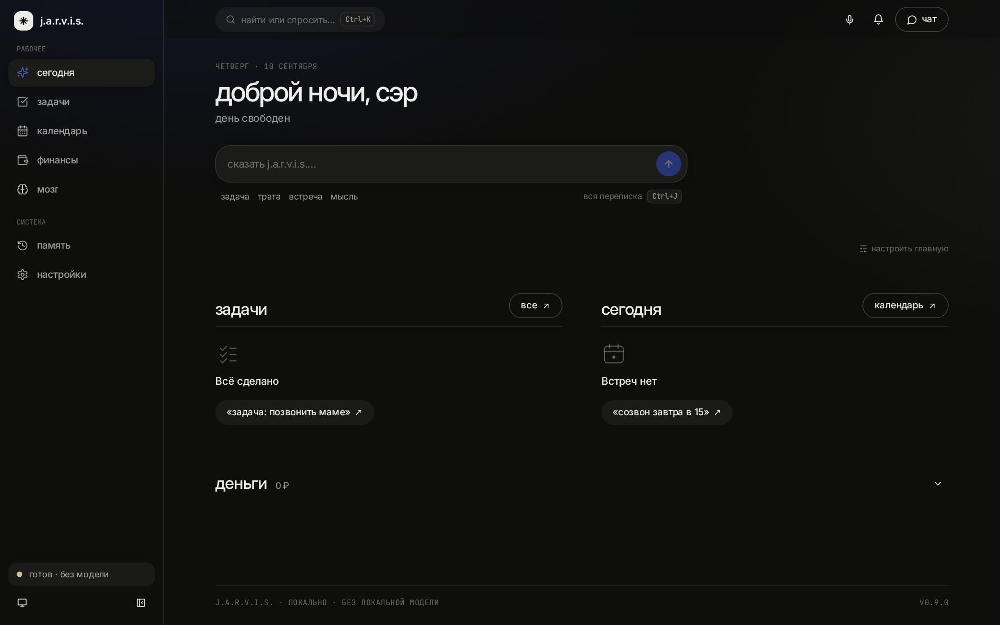
</p>

<p align="center">
  
  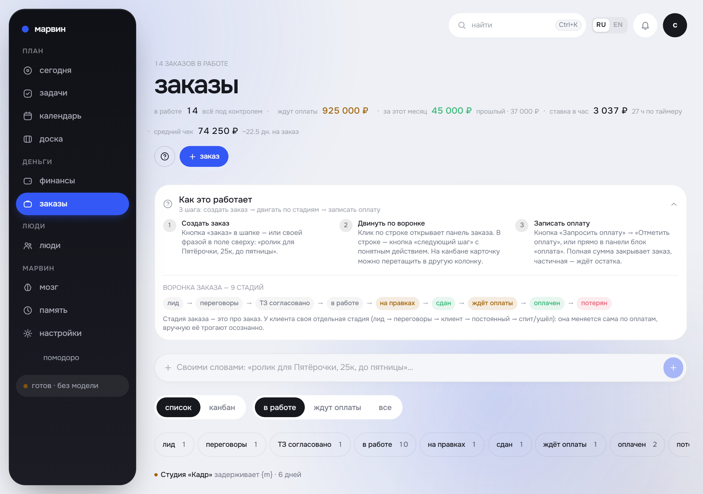
</p>
<p align="center">
  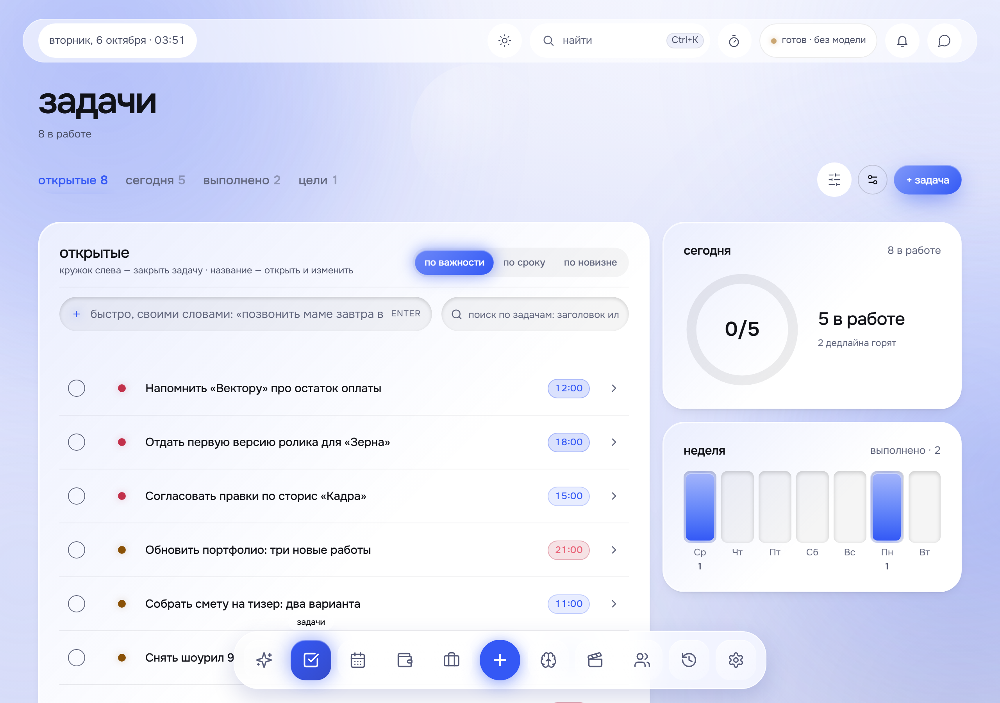
  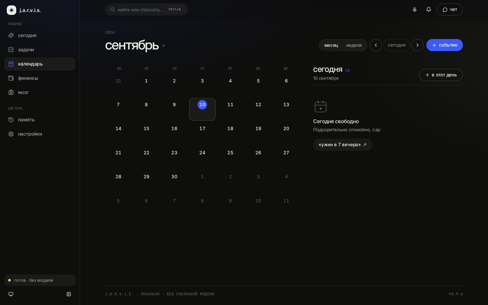
</p>
<p align="center">
  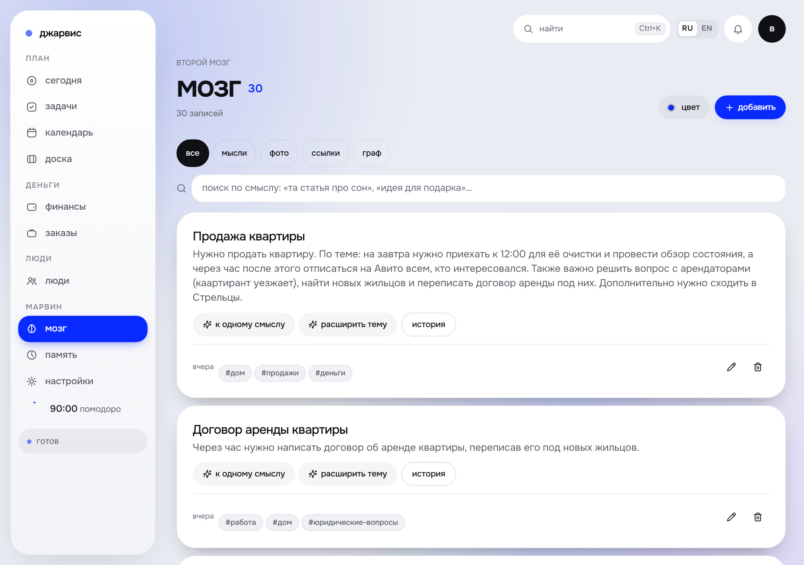
  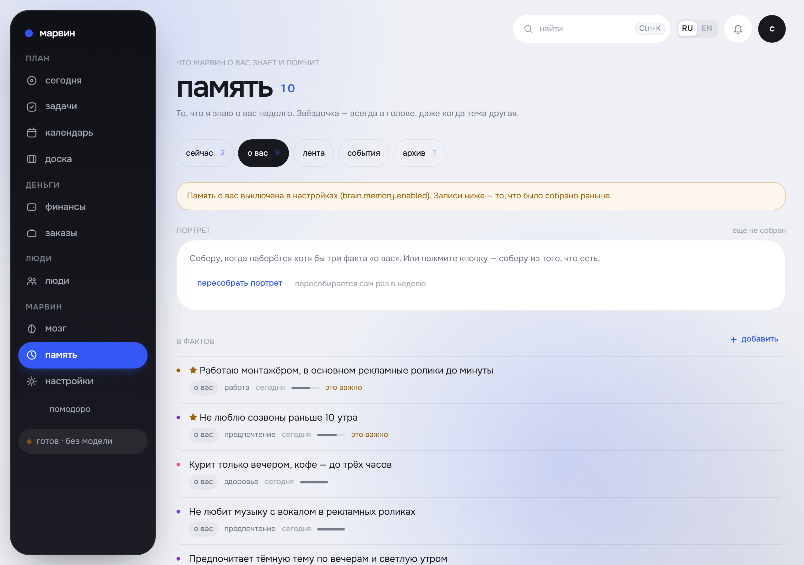
  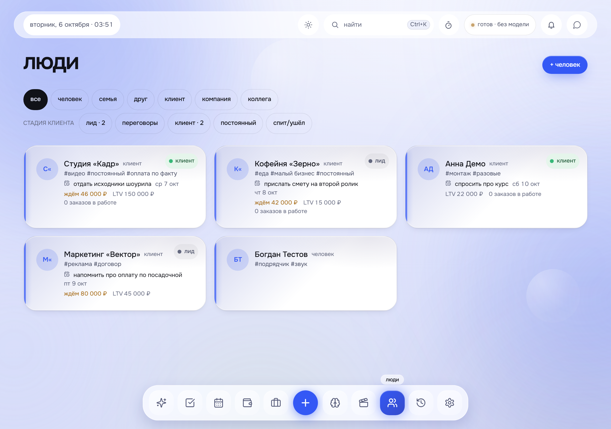
</p>
<p align="center">
  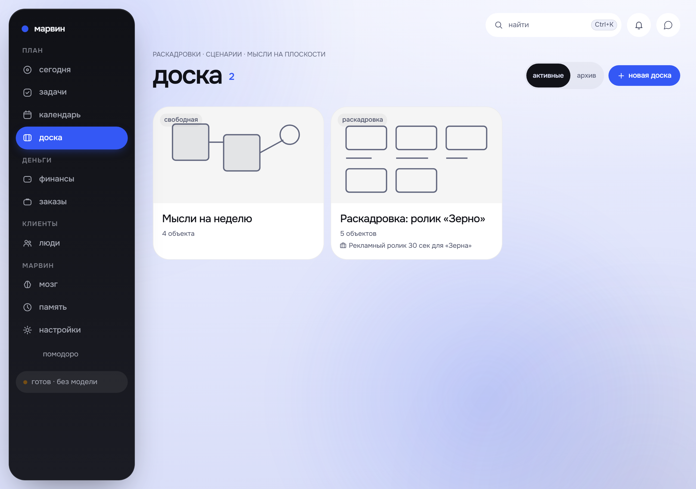
  
  
</p>
<p align="center">
  
</p>
<p align="center">
  
  
  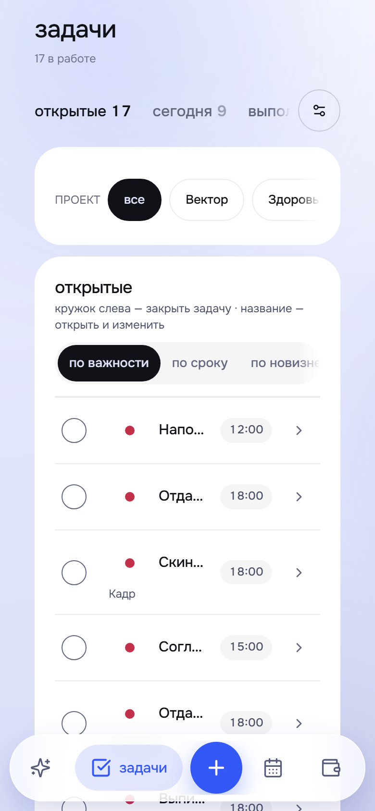
  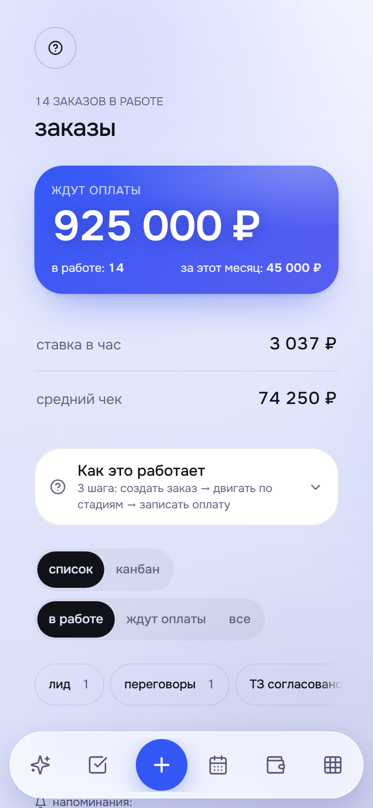
  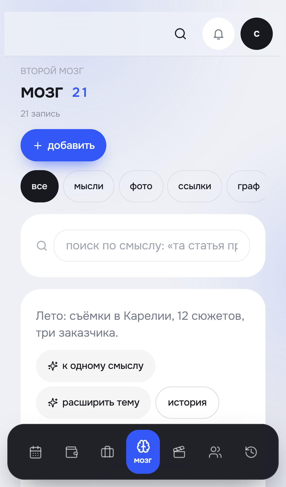
  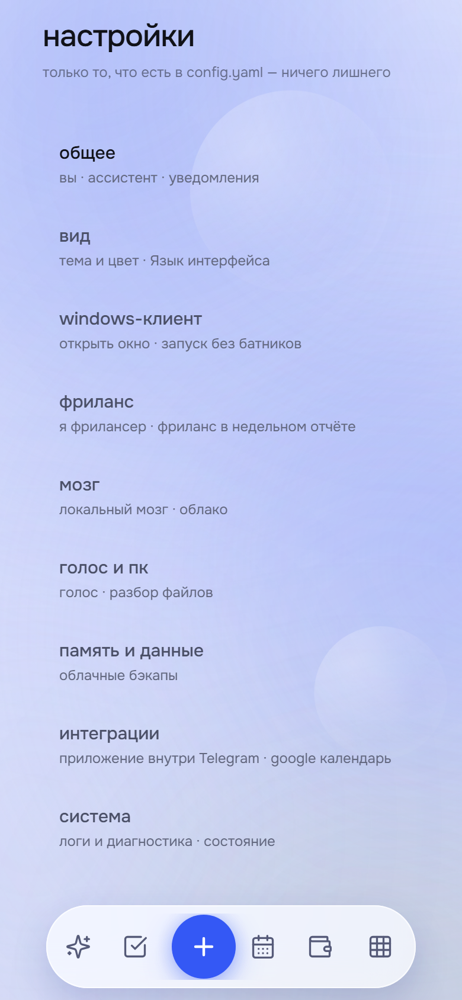
</p>

---

## Что умеет

| | Пример | Что происходит |
|---|---|---|
| 💸 **Деньги** | `700 такси` · `зп 150 тыс` · `долг Сберу 120к плачу 8к 25-го` · `хватит ли до зарплаты` | категории проставляются сами, Т-Банк как основной счёт, касса на 30 дней, долги с прогнозом, выписка Т-Банка файлом, фото чека → трата |
| 📅 **Календарь и задачи** | `встреча в среду в 15 с Димой` · `напомни через 20 минут достать стирку` · `сдать отчёт до пятницы` | напоминания в Telegram и вслух, повторы («каждый пн ср пт»), перенос словами, выгрузка в Google Календарь |
| 💼 **Заказы (фриланс)** | `заказ: ролик для Пятёрочки, 25к, до пятницы` · `пришёл аванс 10к за ролик` · `таймер на ролик` · `цель: подушка 300к к марту` | дедлайн в календаре, ожидаемая оплата в прогнозе кассы, помодоро на сайте/в Telegram/голосом → ставка в час, конверты-цели, 50/30/20, «на сколько хватит» |
| 🧠 **Второй мозг** | `мозг: идея для ролика…` · `запомни …` · ссылка · фото с подписью | заголовок, обложка, теги, выжимка, смысловой поиск («та статья про сон»), правка текста моделью с сохранением оригинала |
| 🎙 **Голос и ПК** | «Марвин, открой ютуб» · «найди файл договор» · «что на экране» · «разбери рабочий стол» | wake word офлайн, Whisper, Silero; медиа-клавиши, игровой режим сам; файлы **никогда не удаляются** |
| ☁️ **Бэкапы в облако** | бэкап раз в час на свой Яндекс.Диск, зашифрован паролем | восстановление с другого компьютера, если ноутбук сгорит или база сломается |
| 🔒 **Приватность** | режимы `local` / `hybrid` / `cloud` | личное — на моей видеокарте; в облако (Groq) только общие вопросы, обезличенно; каждый ответ помечен ⚡ правило · 🧠 локально · ☁️ облако |

Около 40 бытовых фраз работают **без нейросети** — мгновенно, офлайн, даже во время игры. Плюс утренний доклад, вечерний «что с задачами?», недельный отчёт-открытка, откат любого действия («отмена»), ночные бэкапы. [Все команды →](docs/features.md)

<p align="center">
  
  
</p>
<p align="center">
  
  
</p>
<p align="center">
  
  
</p>

---

## Быстрый старт (Windows, 10–15 минут)

1. [Python 3.12](https://www.python.org/downloads/windows/) → при установке галочка **«Add python.exe to PATH»**.
2. Папку `marvin` — например, в `C:\Marvin`. Двойной клик **`install.bat`** — поставит библиотеки и откроет `config.yaml`.
3. В `config.yaml` две строки: `token` (от @BotFather) и `owner_id` (свой ID от @userinfobot). Сохранить.
4. **`start.bat`** — в Telegram придёт «Система онлайн». Сайт: http://localhost:8765

Дальше по желанию, всё кнопками: локальный мозг — [Ollama](https://ollama.com/download) + `ollama pull qwen3.5:4b`; облако для общих вопросов — ключ Groq в ⚙ Настройки → облако; голос — `voice.bat` (для точного распознавания на ПК — `gpu.bat`, тогда доступны `medium`/`large-v3-turbo`); с телефона — `phone.bat` + QR в настройках, а прямо внутри Telegram без VPN — `funnel.bat` ([инструкция](docs/telegram-miniapp.md)); автозагрузка — `autostart.bat`.

Характер (⚙ Настройки → характер): `persona.style: swag` + `persona.humor_level` 3–10 — сухая ирония и подколы; `neutral` — спокойно и по делу.

Пошагово, со всеми вариантами — [docs/install.md](docs/install.md). На **macOS** — [docs/macos.md](docs/macos.md) (`Install-Mac.command`, значок в строке меню, типичные ошибки).

---

## Как запускать

```bat
:: 1. первая установка (один раз)
install.bat

:: 2. запуск: бот + сайт на http://localhost:8765
start.bat
```

- Ядро: `python run.py`. Порт берётся из `config.yaml` (`server.port`, по умолчанию 8765). Флаги: `--no-tg` (без Telegram), `--no-browser`, `--no-voice-warmup`.
- Пересборка сайта после правок в `web/src`: `build_web.bat` (или `cd web && npm run build`) → готовый сайт в `web/site`, дальше перезапустить `start.bat`.
- Node-стенд (тот же фронт на Express): `npm install && npm run dev` → http://localhost:3000. Второй бот на том же токене одновременно с Python-версией не запускаю.
- Тесты: `python -m pytest tests -q` (нужен `pip install -r requirements-dev.txt`) и `npm test` (Node-стенд).
- Переменные окружения — `.env.example` (скопируй в `.env`; в git `.env` не попадает).

### Тесты

Все прогоны идут на **временной/демо-БД**: `data/jarvis.db` тесты на запись не открывают.

```bat
.venv\Scripts\python.exe -m pytest tests -q          :: весь набор (~5 мин)
.venv\Scripts\python.exe -m pytest tests/test_golden_quick.py -q   :: 260 фраз, правила и парсинг
npm test                                             :: Node-стенд (Express, порт 3999)

cd web
npm run build
npm run test:e2e                                     :: Playwright: десктоп + телефон
```

| Набор | Файлы | Что проверяет |
|---|---|---|
| Правила и парсинг | `tests/test_golden_quick.py`, `test_overnight_fase2_parsing.py` | офлайн-команды без LLM: действие, ответ и записи в таблицах. Судья и LLM в фикстуре выключены — набор обязан быть одинаково зелёным каждый раз |
| API и доступ | `tests/test_review_a_*.py`, `test_security_*.py` | доступ, контракты, коды ошибок, идемпотентность, ключи и маскирование |
| Деньги | `tests/test_review_b_*.py`, `test_quality_*.py`, `test_finance_forms.py` | баланс, прогноз кассы, заказы, долги, режимы жизни |
| Надёжность | `tests/test_reliability_*.py`, `test_review_e_*.py` | бэкапы, миграции, ретеншн, старт, логи |
| Сценарии | `tests/e2e/specs/*.spec.js` (Playwright) | финансы, отчёты и CSV, задачи, оплата заказа, память, настройки, доступность |
| Стенд фронта | `tests/*.mjs`, `npm test` | Node-версия сервера |

Ожидаемое, но ещё не починенное поведение помечено `xfail` (и комментарием `KNOWN` в золотом наборе): такие тесты падать не должны, но ловят регресс.

---

## Структура проекта

```
marvin/
├── run.py                 # точка входа: бот + HTTP-сервер + планищ��к
├── start.bat              # запуск (с автоперезапуском) · install.bat — установка
├── server.ts              # альтернативный Node-стенд (Express), npm run dev
├── config.yaml            # рабочий конфиг (в .gitignore, секреты здесь)
├── config.example.yaml    # шаблон конфига без секретов
├── .env.example           # шаблон переменных окружения
├── core/                  # ядро: config, db, brain, tools, services, api, telegram, pc, voice
│   ├── api/app.py         # FastAPI: все /api/* роуты + раздача сайта
│   ├── brain/             # агент, маршрутизация, локальный/облачный мозг
│   ├── services/          # деньги, календарь, задачи, заказы, заметки, память, бэкапы
│   └── telegram/          # бот, Telegram Mini App
├── web/                   # сайт (React + Vite)
│   ├── src/               # исходники UI (страницы, компоненты, api-клиент)
│   ├── site/              # собранная версия — её раздаёт Python-сервер
│   └── node_modules/      # зависимости (в .gitignore)
├── tests/                 # pytest-тесты (Python) и tests/*.mjs (Node)
├── data/                  # база data/jarvis.db, бэкапы, файлы пользователя (в .gitignore)
├── docs/                  # документация: install, macos, features, brain, site, troubleshooting
├── mac/ phone*.* voice*.* # клиенты: macOS, телефон, голос
└── backups/               # бэкапы базы (в .gitignore)
```

---

## Железо и границы приватности

| Режим | Что нужно | Куда уходят данные |
|---|---|---|
| 🔒 **local** | видеокарта от 4–6 ГБ + Ollama | никуда, работает без интернета |
| ⚖️ **hybrid** *(у меня сейчас)* | то же + бесплатный ключ Groq | деньги, календарь, задачи, заметки, файлы — **локально**; разговор и общие вопросы — в облако с вырезанными именами/суммами/телефонами |
| ☁️ **cloud** | любой ноутбук | всё у провайдера, включая заметки и траты |

Моя GTX 1660 Super (6 ГБ) тянет `qwen3.5:4b`; таблица под другие карты — [docs/brain.md](docs/brain.md). Фото из Telegram (в том числе чеки) разбираются в облаке Groq — это осознанный выбор, переключается в `brain.vision.where`.

В любом режиме:

- бот отвечает **только** моему Telegram ID;
- база — файл `data/jarvis.db`; ночной бэкап сам, 30 дней ротация, плюс копия в облако по желанию (зашифрованная);
- с других устройств API открыт только по ключу доступа из QR, бэкапы и восстановление — только с самого компьютера;
- ассистент **никогда не удаляет** файлы на ПК; суммы от 100 000 ₽ и выключение компьютера — только после «да»;
- экранное время (сколько и где сижу за ПК) — **выключено по умолчанию**; включается в настройках → голос и ПК, пишет только имя программы и сайт, хранит 90 дней в моей базе, в облако — никогда;
- Google Календарь — только в одну сторону (ассистент → Google), обратно ничего не читается;
- в режиме `local` наружу не уходит ничего, а команды управления компьютером принимаются только из голоса и моего Telegram — из заметок, ссылок и пересланных сообщений они не выполняются.

> Бесплатные лимиты Groq (~1000 запросов/день) и набор его моделей — по состоянию на 10.09.2026, провайдер меняет их без предупреждения. Если облако «посыпалось» — [docs/troubleshooting.md](docs/troubleshooting.md), это чинится за минуту.

---

## Документация

- [Установка: Windows, телефон, голос, голосовые в Telegram, Google Календарь, обновление](docs/install.md)
- [macOS: установка, автозапуск, типичные ошибки](docs/macos.md)
- [Все команды и что умеет ассистент](docs/features.md)
- [Локальный мозг и железо](docs/brain.md)
- [Сайт внутри Telegram (Mini App): Tailscale Funnel, безопасность, подключение](docs/telegram-miniapp.md)
- [Как устроен мозг и память](docs/brain.md) · [разработка](docs/development.md) · [маршрутизация запросов](docs/routing.md)
- [Если что-то сломалось](docs/troubleshooting.md) · [как откатить](docs/ROLLBACK.md)
- [Правила безопасности проекта](SECURITY.md) · [как это превратить в продукт](docs/product-plan.md)

---

## Что дальше

Планы и текущие задачи — в [ROADMAP.md](ROADMAP.md). Коротко: довести до состояния «поставил — открыл — пользуешься», прикрыть уведомления при закрытом приложении и сделать мобильный режим доски окончательным.

---

## Что изменилось

Полная история — в [CHANGELOG.md](CHANGELOG.md).

### 0.15.0

- Облачные бэкапы: WebDAV (Яндекс.Диск/Nextcloud), шифрование паролем, проверка целостности копии перед тем, как считать её рабочей.
- Бэкап перед изменением схемы базы перестал иногда оставаться пустым файлом.
- Память: старые неподтверждённые факты уходят в архив и не всплывают сами; подтверждённые не гаснут. Появился тост «запомнить?» для новых фактов, учётся тон и правки.
- Режимы жизни: говорю «я уезжаю в армию 28 октября» — средние траты, «свободно» и прогноз кассы считаются по этому периоду.
- Заметки чинятся моделью: «привести к одному смыслу» / «расширить тему», история версий, откат.
- Весь интерфейс переведён на английский (переключатель RU/EN), добавлен блок обучения английскому с абзацем дня.
- Телефон: нижняя навигация, шторки снизу, крупные зоны нажатия, поля 16 px, липкая шапка.
- Подсказки на графиках: наведение или тап показывает период и сумму.
- Канбан не разрастается: в закрытых стадиях 10 последних заказов и «показать ещё».
- macOS: отдельный облегчённый набор зависимостей (установка на Intel Mac падала), скрипты с проверкой окружения, задание macOS в CI.
- Безопасность: ключи видны только как «задан», ограничение подбора ключа, закрыта подстановка текста на странице входа Google, бэкапы только с ПК.
- Скорость: список заказов 42 → 5 SQL-запросов, 14 новых индексов, кэш аналитики.

### 0.14.0

- Заказы стали CRM: воронка из девяти стадий с канбаном на drag&drop, карточка заказа с оплатами и кругами правок, карточка клиента с LTV.
- Follow-up и деньги: напоминания «клиент молчит», просроченный дедлайн, неоплата; оплата заказа создаёт доход без дублей.
- Прогноз кассы в двух сценариях: реалистичный и пессимистичный.
- Дизайн-система: тёмно-синие ступени, лаймовый герой, смысловые цвета, группированный сайдбар.