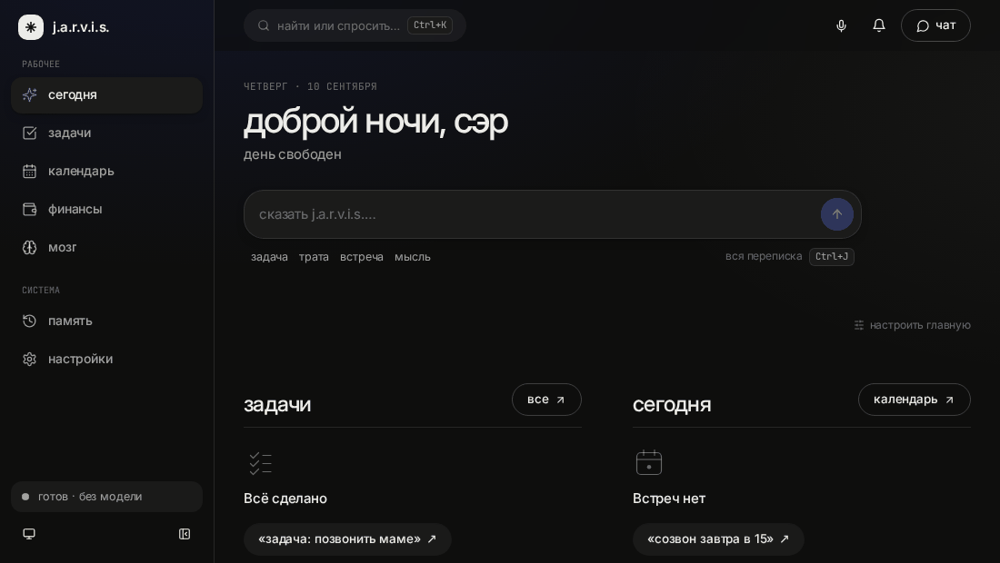
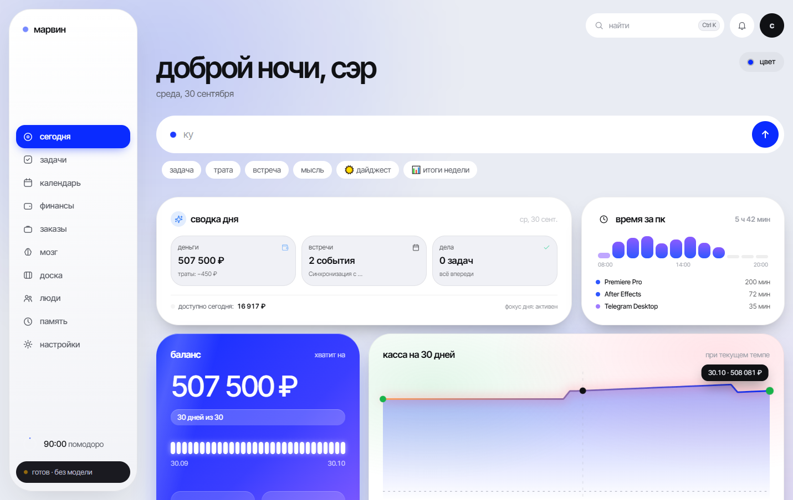
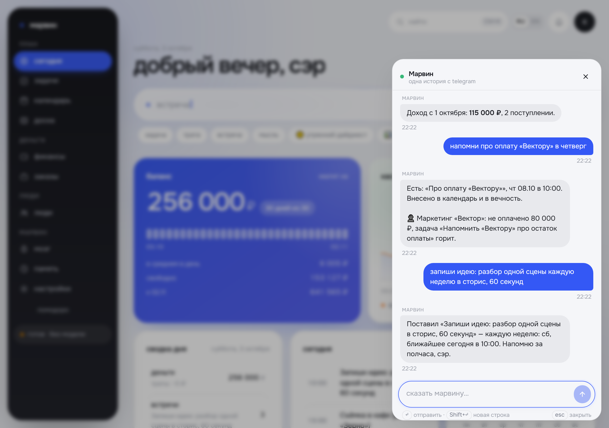
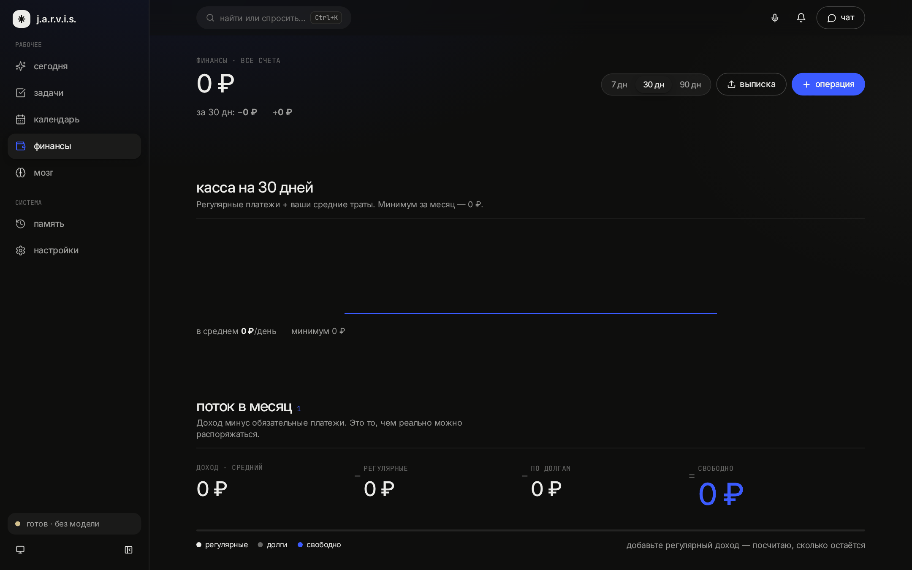
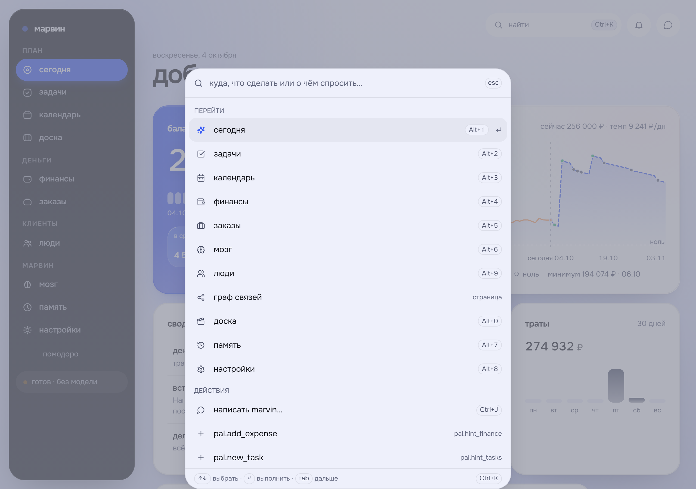
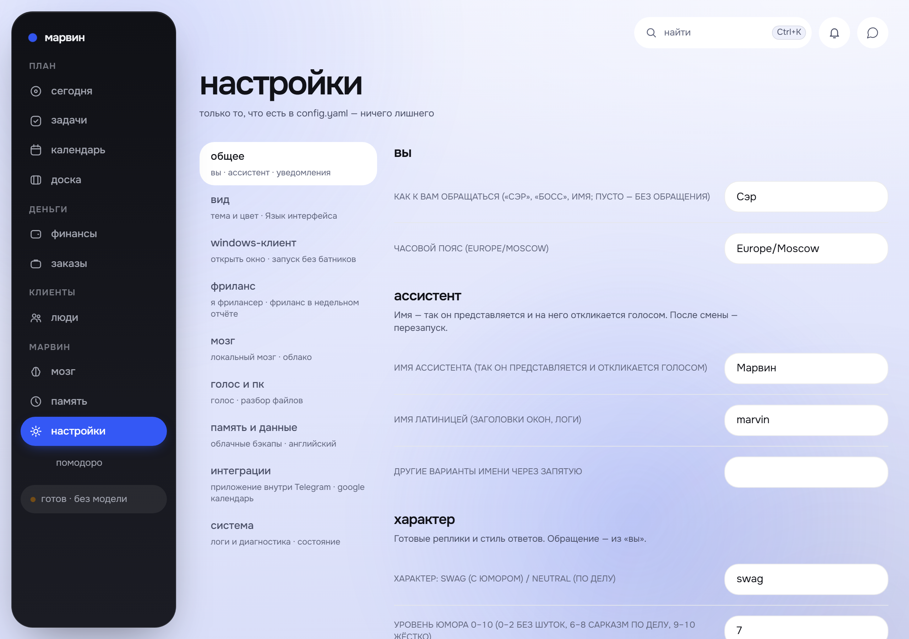
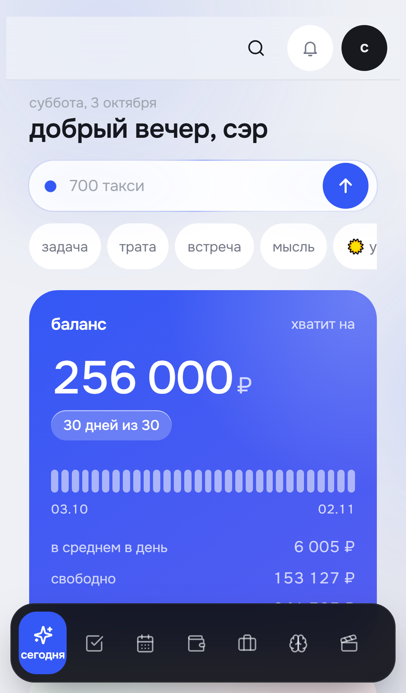
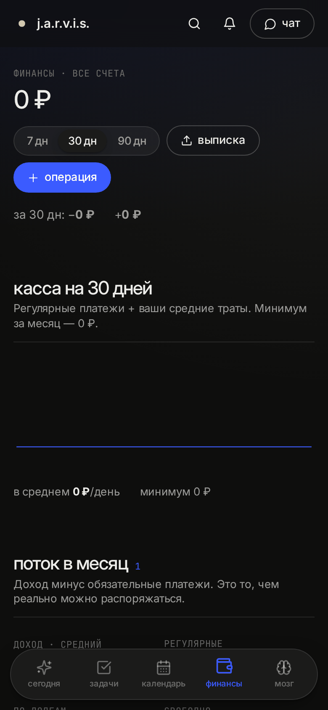

# J.A.R.V.I.S. — личный ассистент на своём ПК

**Деньги, календарь, задачи и «второй мозг» — обычной речью.** Пишешь в Telegram, на сайте или говоришь «Джарвис, …» в микрофон; всё ложится в одну базу на твоём диске, он напоминает, считает, отвечает — с характером Джарвиса из «Железного человека».

Для одного человека, без аккаунтов и подписок: один процесс на Windows, база — обычный файл, личное не покидает компьютер.

## Что нового (0.14.0)

- **Заказы стали CRM.** Воронка из девяти стадий (лид → переговоры → ТЗ → в работе → на правках → сдан → ждёт оплаты → оплачен → потерян) с **канбаном на drag&drop** и обычным списком. Карточка заказа: предоплата и остаток, частичные оплаты, дедлайн, круги правок, чек-лист этапов, таймер и эффективная ставка, лента активности, комментарии. Карточка клиента (в «людях»): LTV, средний чек, текущий долг, источник лида, теги, последний контакт, следующий шаг, история заказов. Старые статусы заказов переносятся без потери данных.
- **Follow-up и деньги.** Напоминания «клиент молчит 7 дней», просроченный дедлайн, неоплата дольше 14 дней + шаблоны сообщений (запрос оплаты, ответ на правки). Оплата заказа создаёт доход в финансах **без дублей** (идемпотентно), ожидаемые оплаты видны в аналитике воронки и топе клиентов.
- **Прогноз кассы в двух сценариях.** Кроме линейной экстраполяции — **реалистичный** (оплаты заказов в срок) и **пессимистичный** (те же оплаты сдвинуты на ~14 дней) сценарии, на графике финансов появляется строка-сводка.
- **Безопасность.** Экран («что на экране») уходит в облако только при явном `brain.vision.where: cloud` — молчаливого запасного пути в `auto` больше нет. Команды управления ПК принимаются **только из каналов владельца**: пересланное сообщение с «выключи компьютер» больше не выполняется. В настройках есть блок **«что уйдёт в облако»** — обезличенное превью текста, только чтение.
- **Интерфейс и мелочи.** Три ступени тёмно-синего фона, лаймовый герой на экран, смысловые цвета (лайм — деньги, янтарь — ожидание, красный — просрочка, фиолетовый — ИИ), компактные пустые виджеты, сгруппированный сайдбар, тултипы, минимальный текст 12px. Починены: единый баланс на главной и в финансах, склонения («1 день / 2 дня / 5 дней»), «список пуст» при активных задачах, подсветка просроченных заказов, лишнее время 23:59 у задач «на весь день», метка «возможно устарело» у старых фактов памяти.
- **Надёжность базы.** Система миграций со `schema_version`, аддитивные миграции с автоматическим бэкапом БД, `busy_timeout`, экспорт данных в JSON/CSV. Существующие данные не удаляются и не переписываются.

<p align="center">
  
</p>

<p align="center">
  
</p>

---

## Шесть главных вещей

| | Пример | Что происходит |
|---|---|---|
| 💸 **Деньги** | `700 такси` · `зп 150 тыс` · `долг Сберу 120к плачу 8к 25-го` · `хватит ли до зарплаты` | категории сами, Т-Банк как основной счёт, касса на 30 дней, долги с прогнозом, выписка Т-Банка файлом, фото чека → трата |
| 📅 **Календарь и задачи** | `встреча в среду в 15 с Димой` · `напомни через 20 минут достать стирку` · `сдать отчёт до пятницы` | напоминания в Telegram и вслух, повторы («каждый пн ср пт»), перенос словами, push в Google Календарь |
| 💼 **Заказы (фриланс)** | `заказ: ролик для Пятёрочки, 25к, до пятницы` · `пришёл аванс 10к за ролик` · `таймер на ролик` · `цель: подушка 300к к марту` | дедлайн в календаре, ожидаемая оплата в прогнозе кассы, помодоро на сайте/в Telegram/голосом → ставка в час, конверты-цели, 50/30/20, «на сколько хватит» |
| 🧠 **Второй мозг** | `мозг: идея для ролика…` · `запомни …` · ссылка · фото с подписью | заголовок, обложка, теги, выжимка, смысловой поиск («та статья про сон») |
| 🎙 **Голос и ПК** | «Джарвис, открой ютуб» · «найди файл договор» · «что на экране» · «разбери рабочий стол» · «статус костюма» | wake word офлайн, Whisper, Silero; медиа-клавиши, игровой режим сам; файлы **никогда не удаляются** |
| 🔒 **Приватность** | режимы `local` / `hybrid` / `cloud` | личное — на твоей видеокарте; в облако (Groq) только общие вопросы, обезличенно; каждый ответ помечен ⚡ правило · 🧠 локально · ☁️ облако |

Около 40 бытовых фраз работают **без нейросети** — мгновенно, офлайн, даже во время игры. Плюс утренний доклад, вечерний «что с задачами?», недельный отчёт-открытка, откат любого действия («отмена»), ночные бэкапы. [Все команды →](docs/features.md)

<p align="center">
  
  
</p>
<p align="center">
  
  
</p>
<p align="center">
  
  
</p>

---

## Быстрый старт (Windows, 10–15 минут)

1. [Python 3.12](https://www.python.org/downloads/windows/) → при установке галочка **«Add python.exe to PATH»**.
2. Папку `jarvis` — например, в `C:\Jarvis`. Двойной клик **`install.bat`** — поставит библиотеки и откроет `config.yaml`.
3. В `config.yaml` две строки: `token` (от @BotFather) и `owner_id` (свой ID от @userinfobot). Сохранить.
4. **`start.bat`** — в Telegram придёт «Система онлайн, сэр». Сайт: http://localhost:8765.

Дальше по желанию, всё кнопками: локальный мозг — [Ollama](https://ollama.com/download) + `ollama pull qwen3.5:4b`; облако для общих вопросов — ключ Groq в ⚙ Настройки → облако; голос — `voice.bat` (для точного распознавания на ПК — `gpu.bat`, тогда доступны `medium`/`large-v3-turbo`; в hybrid/cloud голос распознаёт Groq `whisper-large-v3-turbo`); с телефона — `phone.bat` + QR в настройках, а прямо внутри Telegram без VPN — `funnel.bat` ([инструкция](docs/telegram-miniapp.md)); автозагрузка — `autostart.bat`.

Характер (⚙ Настройки → характер): `persona.style: swag` + `persona.humor_level` 3–10 — сухая ирония и подколы «как у Джарвиса»; `neutral` — спокойно и по делу (для «второго ассистента» близким).

Пошагово, со всеми вариантами — [docs/install.md](docs/install.md).

---

## Как запускать (краткая инструкция)

```bat
:: 1. первая установка (один раз)
install.bat

:: 2. запуск: бот + сайт на http://localhost:8765
start.bat
```

- Python-версия (основная): `start.bat` → `python run.py`. Порт берётся из `config.yaml` (`server.port`, по умолчанию 8765). Флаги: `python run.py --no-tg` (без Telegram), `python run.py --no-browser`, `python run.py --no-voice-warmup`.
- Пересборка сайта после правок во `web/src`: `build_web.bat` (или `cd web && npm run build`) → готовый сайт в `web/site`, перезапусти `start.bat`.
- Node-стенд (альтернативный сервер на Express + тот же фронт): `npm install && npm run dev` → http://localhost:3000, прод-сборка `npm run build` → `dist/`. Второй экземпляр бота на том же токене не запускай одновременно с Python-версией.
- Тесты: `python -m pytest tests -q` (Python, нужен `pip install -r requirements-dev.txt`) и `npm test` (Node-стенд).
- Переменные окружения — см. `.env.example` (скопируй в `.env`; в git `.env` не попадает).

---

## Тесты

Все прогоны работают на **временной/демо-БД**; `data/jarvis.db` тесты не открывают на запись.

```bat
:: основной прогон (офлайн, ~5 мин)
.venv\Scripts\python.exe -m pytest tests -q

:: только наборы ревью (быстрее)
.venv\Scripts\python.exe -m pytest tests/test_review_a_*.py tests/test_review_b_*.py -q
.venv\Scripts\python.exe -m pytest tests/test_golden_quick.py -q      :: 260 фраз, правила/парсинг

:: Node-стенд (Express, порт 3999)
npm test

:: e2e (Playwright): сначала собрать сайт
cd web
npm run build
npm run test:e2e                     :: порт по умолчанию 8917
$env:E2E_PORT='8921'; npm run test:e2e   :: свой порт, если 8917 занят
```

Что где лежит:

| Набор | Файлы | Что проверяет |
|---|---|---|
| Правила и парсинг | `tests/test_golden_quick.py` (260 фраз), `test_overnight_fase2_parsing.py` | офлайн-команды без LLM: действие, ответ и записи в 9 таблицах. Судья и LLM в фикстуре выключены — набор обязан быть одинаково зелёным каждый раз |
| Ревью A — API и безопасность | `tests/test_review_a_{access,contract}.py` | доступ, контракты, коды ошибок, идемпотентность |
| Ревью B — деньги | `tests/test_review_b_{balance,forecast,orders_debts}.py` | баланс, прогноз кассы, заказы и долги |
| Ревью D — сценарии | `tests/e2e/specs/*.spec.js` (Playwright, desktop + mobile) | финансы, отчёты и CSV, задачи, оплата заказа, память, настройки, доступность |
| Ревью E — надёжность | `tests/test_review_e_*.py` | миграции, старт, SSE, логи, ошибки |
| Стенд фронта | `tests/*.mjs`, `npm test` | Node-версия сервера |

Ожидаемое поведение, которое пока **не** починено, зафиксировано меткой `xfail`
(и комментарием `KNOWN` в золотом наборе) со ссылкой на отчёт в `reviews/` —
такие тесты падать не должны, а регресс ловят.

---

## Структура проекта

```
jarvis-main/
├── run.py                 # точка входа: бот + HTTP-сервер + планировщик
├── start.bat              # запуск (с автоперезапуском) · install.bat — установка
├── server.ts              # альтернативный Node-стенд (Express), npm run dev
├── config.yaml            # рабочий конфиг (в .gitignore, секреты здесь)
├── config.example.yaml    # шаблон конфига без секретов
├── .env.example           # шаблон переменных окружения
├── core/                  # ядро: config, db, brain, tools, services, api, telegram, pc, voice
│   ├── api/app.py         # FastAPI: все /api/* роуты + раздача сайта
│   ├── brain/             # агент, маршрутизация, локальный/облачный мозг
│   ├── services/          # деньги, календарь, задачи, заказы, заметки, память, бэкапы
│   └── telegram/          # бот, Telegram Mini App
├── web/                   # сайт (React + Vite)
│   ├── src/               # исходники UI (страницы, компоненты, api-клиент)
│   ├── site/              # собранная версия — её раздаёт Python-сервер
│   └── node_modules/      # зависимости (в .gitignore)
├── vite.config.ts         # сборка фронта (web/src) → dist/ для server.ts
├── tests/                 # pytest-тесты (Python) и tests/*.mjs (Node)
├── data/                  # база data/jarvis.db, бэкапы, файлы пользователя (в .gitignore)
├── docs/                  # документация: install, features, brain, site, troubleshooting
├── vendor/                # офлайн-зависимости (whisper и т.п.)
├── mac/ phone*.* voice*.* # клиенты: macOS, телефон, голос
└── _archive/              # старое и дубли — ничего не удалено, просто отложено (в .gitignore)
```

> **Node-стенд.** Фронт один и тот же: исходники живут в `web/src`, а `vite.config.ts` в корне собирает их в `dist/` для `server.ts`. Старая корневая копия `src/` (дубль) и старые релизные заметки — в `_archive/web/root-vite-duplicate/` и `_archive/releases-marvin/`.

---

## Железо и границы приватности

| Режим | Что нужно | Куда уходят данные |
|---|---|---|
| 🔒 **local** | видеокарта от 4–6 ГБ + Ollama | никуда, работает без интернета |
| ⚖️ **hybrid** *(текущий)* | то же + бесплатный ключ Groq | деньги, календарь, задачи, заметки, файлы — **локально**; разговор и общие вопросы — в облако с вырезанными именами/суммами/телефонами |
| ☁️ **cloud** | любой ноутбук | всё у провайдера, включая заметки и траты |

Твоя GTX 1660 Super (6 ГБ) — `qwen3.5:4b`; таблица под другие карты — [docs/brain.md](docs/brain.md). Фото из Telegram (в том числе чеки) сейчас разбираются в облаке Groq — это твой осознанный выбор, переключается в `brain.vision.where`.

В любом режиме:

- бот отвечает **только** твоему Telegram ID;
- база — файл `data/jarvis.db`; бэкап = копия файла (ночью сам, 30 дней, вторая копия на другой диск по желанию);
- с других устройств API открыт только по ключу доступа из QR;
- Джарвис **никогда не удаляет** файлы на ПК; суммы от 100 000 ₽ и выключение компьютера — только после «да»;
- экранное время (сколько и где сидишь за ПК) — **выключено по умолчанию**; включается в настройках → голос и ПК, пишет только имя программы и сайт, хранит 90 дней в твоей базе, в облако — никогда;
- Google Календарь — только в одну сторону (Джарвис → Google), обратно ничего не читается.

> Бесплатные лимиты Groq (~1000 запросов/день) и набор его моделей — по состоянию на 10.09.2026, провайдер меняет их без предупреждения. Если облако «посыпалось» — [docs/troubleshooting.md](docs/troubleshooting.md), это чинится за минуту.

---

## Документация

- [Установка: Windows, телефон, голос, голосовые в Telegram, Google Календарь, обновление](docs/install.md)
- [Сайт внутри Telegram (Mini App): Tailscale Funnel, безопасность, подключение](docs/telegram-miniapp.md)
- [Джарвис для мамы: вторая копия на вашем ПК одним `mama.bat` — свой бот, память, бюджет, только облако](docs/second-copy.md) · [памятка для мамы](docs/ДЛЯ_МАМЫ.md)
- [Что умеет — все команды по областям](docs/features.md)
- [Сайт: разделы, жесты на телефоне, горячие клавиши, настройки вида](docs/site.md)
- [Мозг: режимы, модели под видеокарту, провайдеры](docs/brain.md)
- [Если что-то не так](docs/troubleshooting.md)
- [Где что лежит, разработка](docs/development.md) · [Архитектура](ARCHITECTURE.md) · [Дизайн-система](web/DESIGN.md)
- [История изменений](CHANGELOG.md) · [Планы](ROADMAP.md)
