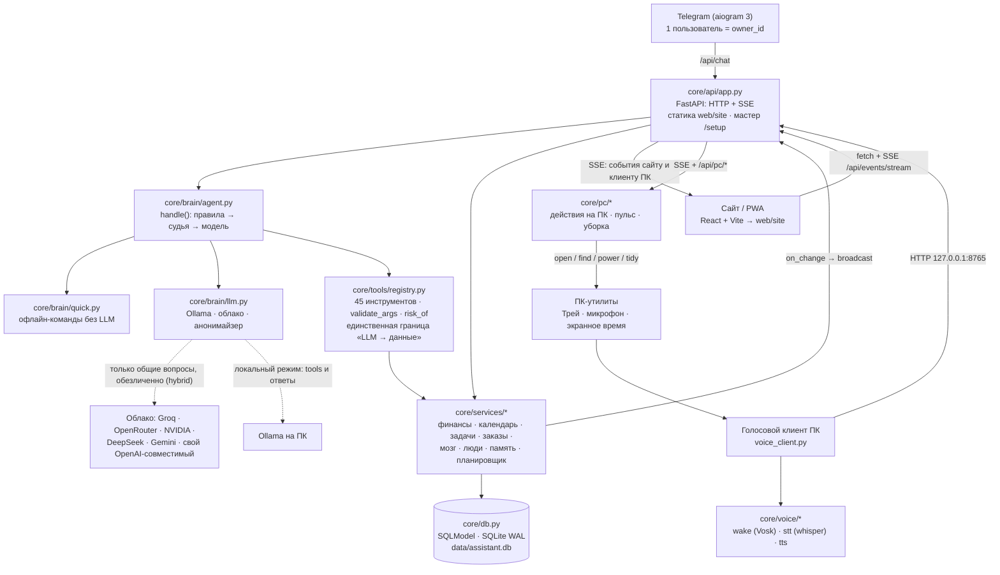

# Архитектура

Здесь — как всё устроено на самом деле (версия 0.13.0). Это не «желаемое», а то, что лежит в коде: один Python-процесс на твоём компьютере, который держит базу, отдаёт сайт, ведёт Telegram-бота и слушает голосового клиента. Документ короткий; глубину по подсистемам смотри в [features.md](features.md), [brain.md](brain.md) и [VOICE.md](VOICE.md).

## Одной картинкой



Ключевая мысль: модель **не трогает базу напрямую**. Она может только попросить инструмент из `registry.py`, а тот уже вызывает сервисы и БД. Поэтому личные данные не «зависят от честности модели»: любая запись идёт через валидацию и проверку результата чтением базы.

## Точка входа

`run.py` (~220 строк) запускает всё в одном процессе:

1. инициализирует БД (`init_db`) и восстанавливает снимок присутствия;
2. прогревает Ollama (если доступна) и локальные голосовые модели;
3. поднимает **uvicorn** с приложением `core/api/app.py` (порт 8765);
4. запускает **Telegram-бота** (long polling, только `owner_id`);
5. запускает **планировщик** (APScheduler): напоминания, дайджесты, бэкап, ночная уборка, платежи.

Флаги запуска: `python run.py --no-tg` — без Telegram (например, пока нет токена). При первом запуске (мастер не пройден) открывается браузер с `http://localhost:8765/setup`.

## HTTP и SSE

`core/api/app.py` (~2700 строк, около 190 маршрутов) — REST для сайта и единственный вход для всех каналов:

- `POST /api/chat` и `POST /api/chat/stream` — фраза ассистенту (сайт, Mini App, голосовой клиент);
- `GET /api/events/stream` — **SSE**: ядро пушит события сайту (обновление виджетов) и клиенту ПК (выполнить действие);
- `/api/settings` — чтение/запись `config.yaml` через белый список (`EDITABLE`);
- `/api/setup/*`, `/api/phone*`, Google OAuth, `/api/diagnose`, `/api/status`;
- статика собранного сайта из `web/site/`.

Доступ (`core/api/auth.py`): запросы с самого ПК (loopback) пускаются свободно; всё остальное — по токену `data/api_token` (cookie из QR/ссылки или заголовок `X-Auth-Token`). Запросы с признаками обратного прокси (`X-Forwarded-*`, например Tailscale Funnel) считаются **внешними**, даже если пришли с `127.0.0.1`. Мастер `/setup`, `/api/phone` и ротация ключа — только физически с ПК. Вход из Telegram Mini App проверяется в `core/api/tg_auth.py` (HMAC от токена бота, свежесть `auth_date`, `owner_id`).

## Мозг

`core/brain/` — путь фразы:

1. `normalize_spoken` → `quick.py`: короткие ответы и отчёты без модели (`сколько потратил на еду`, `что завтра`, балансы, переводы, подписки…);
2. `_resolve_pending`: ответ «да/нет» на висящий вопрос (переживает перезапуск);
3. `rules()` в `agent.py`: регулярки на траты, события, задачи, долги, повторы, заметки, правки; длинные и аналитические тексты шаблоны пропускают;
4. `is_personal(text)` решает, куда идти дальше: если это разговор — в облако (обезличенно), иначе — локальная модель с инструментами;
5. `via_ollama`: системный промпт + история → до 4 раундов tool calls → `registry.call` → финальная фраза. Предохранители: «модель сказала, что записала» без вызова инструмента → записываем сами; вопрос о цифрах без инструмента → вызываем сами; модель хочет сохранить вопрос/анализ в заметку → отклоняем. Есть «страж правды»: ответ сверяется с реальным результатом инструментов;
6. `_changed()` → `agent.on_change` → SSE → сайт обновляет виджеты, ПК-клиент выполняет действия.

Режимы (`llm.MODE`): `local` (только Ollama), `hybrid` (личное — локально, общее — в облако), `cloud` (всё у провайдера; при `cloud` инструменты выполняет облачная модель). Проверка «есть ли облако» — `llm.cloud_enabled()`. Анонимайзер `llm.anonymize()` вырезает имена/суммы/телефоны и секретные ключи перед отправкой, а известные имена из базы заменяет на `[имя]`.

## Инструменты — граница «LLM → данные»

`core/tools/registry.py` (~1000 строк) описывает 45 инструментов с JSON-схемами: календарь, задачи, цели, доски, память, финансы, долги, регулярные, заказы, люди, помодоро, прогнозы. Каждый вызов:

- `validate_args` — типы, диапазоны, обязательные и лишние поля, длины;
- `risk_of` — `read` / `write` / `destructive`; для опасных операций подтверждение;
- `call` — сервис → БД → `ToolResult`; успех проверяется **чтением базы** после записи (`_after_check`).

Это единственное место, откуда модель может что-то изменить. Поэтому «tools» в режиме `cloud` — осознанный выбор: тогда запросы к данным идут через облако.

## Сервисы и данные

`core/services/` (37 модулей) — предметная логика: `finance`, `calendar`, `gcal`, `tasks`, `aims`, `goals`, `orders`, `cards`, `brain_notes`, `memory`, `relations`, `people`, `graph`, `semantic`, `judge`, `insights`, `health`, `state`, `events`, `timeline`, `routines`, `decisions`, `proactive`, `scheduler`, `trace`, `undo`, `screen`, `pc`, `boards`, `bank_import`, `bulk`, `polish`, `missed`, `pulse`, `match`, `habits`, `coord`.

`core/db.py` — SQLModel поверх SQLite (WAL, `check_same_thread=False`). Одна база: `data/assistant.db`. Таблицы: события, задачи, цели, вехи, счета, категории, транзакции, регулярные, долги, клиенты, заказы, рабочие сессии, заметки, ссылки, доски и объекты доски, память, факты, связи, эмбеддинги, сообщения чата, настройки, журнал действий, уроки, запуски, слоты экранного времени. Подробнее про данные и приватность — [PRIVACY.md](PRIVACY.md).

## Сайт

`web/src/` — React + Vite + Tailwind: 10 страниц (Сегодня, Задачи, Календарь, Финансы, Заказы, Доска, Мозг, Люди, Память, Настройки), чат с одной историей на все каналы, палитра `Ctrl+K`. `web/src/lib/api.js` — единая точка fetch, SSE живёт в `App.jsx`. Собранный бандл коммитится в `web/site/`, чтобы пользователю без Node ничего не собирать; после правок фронта — `build_web.bat`. Описание интерфейса — [UI.md](UI.md).

## ПК-клиент, голос и Telegram

- **Голосовой клиент** (`voice_client.py`, ~900 строк) — отдельный процесс: wake word (Vosk), запись до паузы, распознавание (faster-whisper локально), HTTP-запрос к ядру, озвучка (Silero/Edge), иконка в трее, пульс присутствия. Модули `core/voice/{wake,stt,tts}.py` — общая логика моделей. Подробно — [VOICE.md](VOICE.md).
- **ПК-действия** (`core/pc/`): `actions.py` (открыть/найти/медиа/питание/буфер; `open_app` без `shell=True`, только найденные программы), `loop.py` (пульс, игровой режим), `organize.py` и `tidy.py` (уборка папок с планом и откатом — файлы только переносятся, никогда не удаляются).
- **Telegram** (`core/telegram/bot.py`, ~1070 строк): owner-only, текст/голос/фото/файлы, `send_long`, кнопки подтверждений, меню команд, Mini App. Список команд — [COMMANDS.md](COMMANDS.md).

## Строение папок

```
run.py                     точка входа: API + сайт + Telegram + планировщик
voice_client.py            голосовой клиент ПК (отдельный процесс)
setup.py                   установка: .venv, зависимости, config.yaml
doctor.py                  диагностика окружения
core/
  __init__.py              VERSION / BUILD
  config.py                загрузка config.yaml/.env/.env, EDITABLE, запись настроек
  db.py                    модели и движок SQLite
  identity.py              имя ассистента, падежи, wake-паттерн
  api/                     app.py (HTTP+SSE), auth.py, tg_auth.py, setup.html
  brain/                   agent, llm, quick, dates, persona, sorter, attention
  tools/registry.py        45 инструментов — граница «LLM → данные»
  services/                предметная логика (37 модулей) + scheduler
  telegram/bot.py          Telegram-бот
  pc/                      действия, пульс, уборка на ПК
  voice/                   wake, stt, tts
web/
  src/                     исходники сайта (React + Vite)
  site/                    собранный сайт (коммитится)
data/                      база, медиа, бэкапы, модели — не в git
tests/                     pytest (офлайн, временная БД)
docs/                      эта документация
Dockerfile, docker-compose.yml
```

## Известные ограничения (не баги, но знать полезно)

- **Монолиты `app.py` и `agent.py`** — работают и тестируются, но правки требуют внимания. Разбивать «ради красоты» не стали — осознанно, при следующей крупной фиче. См. [ROADMAP.md](ROADMAP.md).
- **SQLite + один пользователь.** Многопользовательности нет нигде (в таблицах нет `user_id`). При переезде на VPS с несколькими клиентами это стоит держать в уме.
- **История чата для модели — 6 сообщений / 600 символов** — компромисс под окно маленьких моделей.
- **Собранный фронт коммитится в `web/site/`.** После правок `web/src` нужен `build_web.bat`.
- **Планировщик in-memory.** При перезапуске напоминания пересчитываются от данных; `misfire_grace_time=3600` покрывает сон ПК.
